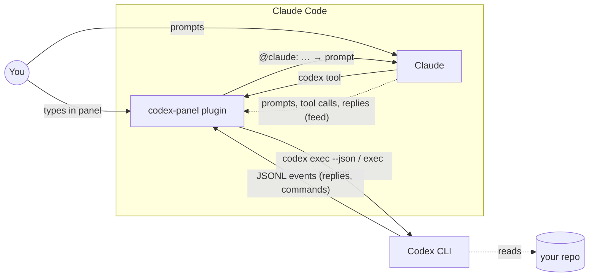

# codex-panel

**Claude Code and Codex, side by side, talking to each other.**

A Claude Code plugin that opens a live [Codex](https://github.com/openai/codex) session in a side panel. You chat with Codex while Claude works. Claude can ask Codex for a review or a second opinion. Codex can hand findings back to Claude. Codex sees what Claude is doing, so you never have to paste context between them.

<!-- Demo video: on github.com, edit this file and drag the .mp4 here; GitHub turns it into an embedded player. -->

```
◆ Codex                                  ● ready
▸ in my-app
week ━━━━━━━━━━━━ 63% left · resets Oct 8

❯ review what Claude just changed
  ✓ git diff
◆ The new retry loop never resets `attempt`
  after a success. @claude: reset it in
  runOne before the next send.
  ✓ → Claude delivered: reset it in runOne…

╭──────────────────────────────────────────╮
│ Message Codex                            │
╰──────────────────────────────────────────╯
＋ New chat   ✕
▸ ⚙ Default · Low · Read-only
```

## Install

```
npx claude-codex-panel
```

Or inside Claude Code:

```
/plugin marketplace add saiharsha03/codex-panel
/plugin install codex-panel@codex-panel
```

Then run `/reload-plugins`. `/codex` opens the panel and `/codex off` closes it.

### You need

- **Claude Code**, a version with plugin hooks (mods).
- **The Codex CLI**: `npm i -g @openai/codex`, or the Codex app.
- **A Codex sign-in**: a ChatGPT plan (Plus, Pro, Business, Edu, Enterprise) or an OpenAI API key. If you are not signed in, the panel shows a **Sign in** button that runs `codex login`.

Codex's work runs on your Codex plan or API key. When Claude reads or answers a message from Codex, that uses your Claude usage as usual.

## What it does

- **A real Codex session.** Your first message starts a Codex thread and later messages continue it. The thread survives reloads and `claude --resume`, and `codex resume <id>` opens it in Codex itself.
- **Live output.** Codex's replies and the commands it runs stream in as they happen, marked ✓ or ✗.
- **Claude → Codex.** Claude gets a `codex` tool. Ask Claude to "get a second opinion from Codex" and the reply comes back to Claude.
- **Codex → Claude.** When Codex starts a paragraph with `@claude:` in a reply to you, that text goes to Claude as a prompt. The panel shows whether it is waiting for Claude or delivered. Codex's replies to Claude never bounce back, so the two can't loop. **✻ Send to Claude** forwards Codex's last reply by hand.
- **Shared context.** Each message to Codex starts with what happened in Claude's session since the last one: your prompts, Claude's tool calls and results, and Claude's replies.
- **Queueing.** Messages you send while Codex is working wait their turn, and each one has a ✕ to remove it. **⚡ Interrupt & send** stops the current run and sends yours next.
- **Settings** sit behind one summary line:
  - **Model:** `Default` uses your `~/.codex/config.toml`.
  - **Effort:** low, medium or high.
  - **Access:**
    - **Read-only**, the default.
    - **Can edit:** Codex can change files in the workspace.
    - **YOLO:** no sandbox, with a red banner while it is on.

## How it works



The plugin is one hooks module running inside Claude Code. There is no server and nothing to configure.

1. **The panel is a Claude Code pane** the plugin draws: a message box, the conversation, and buttons.
2. **Each message is one Codex run.** The first runs `codex exec --json`, and Codex answers with a thread id. Later messages run `codex exec resume <thread> --json`, so Codex keeps the whole conversation. Its JSONL events stream into the panel as they arrive. The thread id is stored per Claude session, which is why the chat survives a reload.
3. **Claude → Codex.** The plugin registers a tool, `mcp__codex-panel__codex`. When Claude calls it, the message joins the same thread and the call returns at once, so Claude keeps working; Codex's final reply arrives later as a new prompt to Claude. With `wait: true` the call blocks and returns the reply as the tool result instead.
4. **Codex → Claude.** If Codex's reply to *your* message has a paragraph starting `@claude:`, the plugin submits that text to Claude as a prompt. Claude Code holds it until Claude is free, then delivers it once.
5. **Shared context.** The plugin watches Claude's session: your prompts, Claude's tool calls and their results, and Claude's final answers. It keeps a short, redacted log of them and puts it in front of the next message to Codex, with the path to Claude's transcript in case Codex needs more.
6. **One thing at a time.** A queue makes sure only one Codex run uses the thread at a time. Messages sent meanwhile wait their turn, and Interrupt & send puts yours first.

## What Codex can see (read this)

- **The feed.** Each message to Codex includes your recent prompts, Claude's commands and replies, and the path to Claude's transcript file. Common key and token patterns are hidden first: `sk-…`, `ghp_…`, AWS keys, `Bearer …`, and `password=` / `"api_key": …` values. This is best effort, not a guarantee, and it covers only this feed: what you type in the panel and what Claude sends through the `codex` tool go to Codex as written.
- **Files.** Codex's sandbox can read files on your machine, Claude's full transcript included. Hiding keys in the feed does not stop Codex from opening a file.
- **@claude: messages are written by Codex.** Treat them like any other model output. Codex can be misled by content it reads, so read what it asks before letting Claude act on it. Codex only reaches Claude when you started the exchange from the panel.
- **Claude's messages always run read-only.** Whatever Access you pick applies only to messages you type in the panel. Otherwise Claude could get around its own permission prompts by asking a can-edit or YOLO Codex to run things for it.
- **YOLO** means Codex can run any command with no sandbox. Use it only when you would let Codex loose in a terminal.

## Limits

- **No live steering.** A message sent while Codex works waits for the turn to finish; Codex does not read it between tool calls the way the Codex app does. Use **⚡ Interrupt & send** to redirect sooner.
- **One-line input.** The plugin API only has a one-line text field. Long drafts show wrapped above it as you type.
- **No pinned input box.** The panel scrolls as one block, so the plugin shows only the newest messages that fit, to keep the input box on screen.
- **The week bar needs `bash`.** It reads Codex's session logs; without `bash` the header just says "Codex".

## Troubleshooting

- **"thread … already has an active writer"**: a just-stopped run still holds the thread. The panel waits and retries for about 12 seconds.
- **"Codex CLI not found"**: install it, then press **↻ Check again**.
- **"Codex is not signed in"**: press **→ Sign in**, or run `codex login` in a terminal.

## License

MIT
